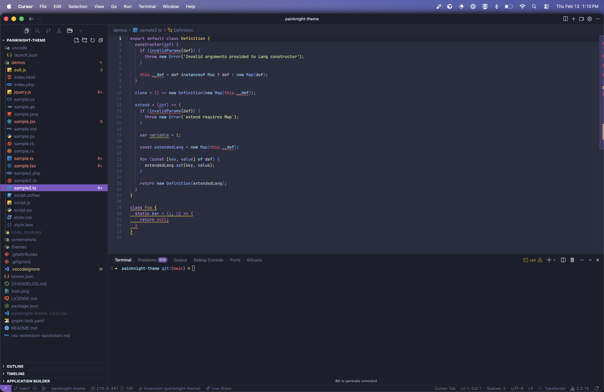

# PainKnight Theme

A darkern take on the beloved Palenight material theme for Visual Studio Code.

*Forked from [Palenight Theme](https://github.com/whizkydee/vscode-palenight-theme) by [Olaolu Olawuyi](https://olaolu.dev). All credit for the original design goes to them.*

## What changed

- Darker sidebar and editor backgrounds for reduced glare
- Improved markdown readability
- Same material-inspired palette and syntax highlighting as the original

## Screenshots

## Installation

1. Open the **Extensions** sidebar in VS Code (`View → Extensions`)
2. Search for **PainKnight**
3. Install **PainKnight Theme** by **Ross Reicks**
4. Go to **File → Preferences → Color Theme** and select **PainKnight Theme**

## License

MIT. The original Palenight Theme is by Olaolu Olawuyi; this fork is maintained by Ross Reicks.
